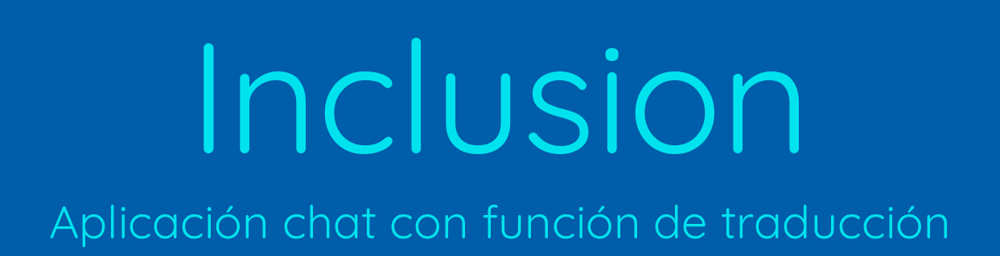
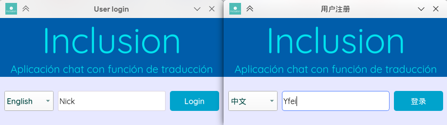
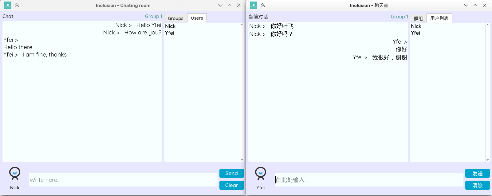

***
[English]\
_Project for subject multimedia technologies and interaction._

The inclusion app pretends to be a chat application for acting as intermediary in conversations in which multiple languages are involved, our goal is providing to the user an interface completely in his native language using google translate API for translating other's user messages.

***
[Español]\
_Proyecto para la asignatura tecnologías multimedia e interacción._

La aplicación inclusion pretende ser una aplicación de chat de escritorio la cual sirva como intermediaria en conversaciones en la que intervengan varios idiomas, de forma que el usuario final solamente vea los mensajes en su idioma nativo traduciendo los mensajes entre usuarios con la API de Google translate.

# Capuras

## Registro en la aplicación [Inglés/Chino]

  

## Aplicación de chat [Inglés/Chino]

  

_Fecha de entrega [14 de mayo de 2021]_

_Autores: Liu Yfei, Jhohan Herrera, Ernesto Aranda, Antonio Vázquez._
